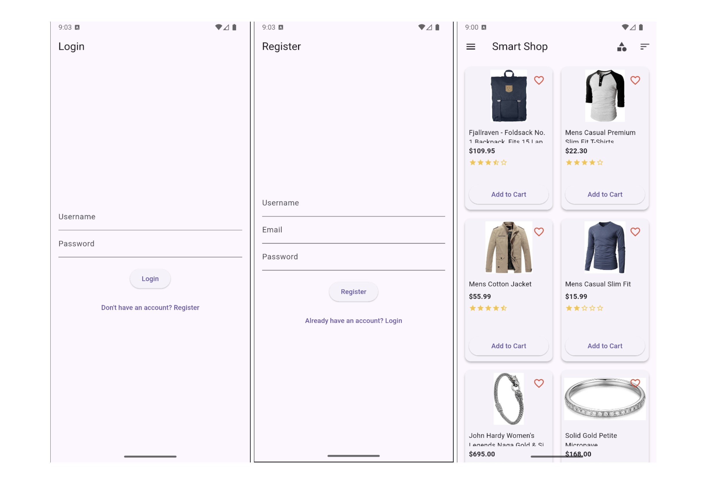
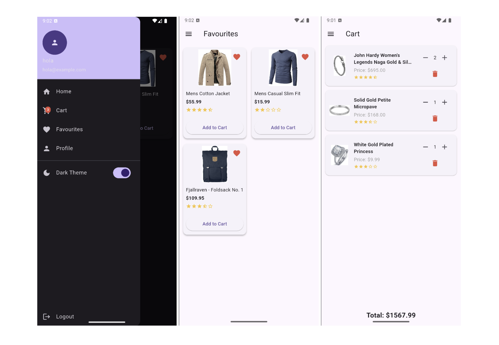

# Smart Shop

A **Flutter mini e-commerce app** built using state management with `Provider`, theme persistence with `SharedPreferences`, and RESTful data fetched from the [FakeStore API](https://fakestoreapi.com). It includes core shopping features like login, product list, cart, favourites, sorting, rating display, and more.

---

## Features Summary

### Core Features 

* Login & Register with validation (uses dummy credentials)
* Splash screen with login status check
* Home screen displaying product list from API
* Add/Remove items to cart
* View & manage favourites
* Product details with price and rating
* Cart screen with total calculation
* Theme switching (Dark/Light)
* Drawer-based navigation
* Logout clears shared preferences

### Additional Features

* Rating stars shown on product cards and in cart
* Pull-to-refresh product list
* Sorting by price (low → high, high → low) & rating
* Cart icon with live badge showing item count
* Persist favourites using SharedPreferences
* Organized folder structure with Provider & MVC pattern

---

## Frameworks

* **Flutter** (UI)
* **Provider** (State Management)
* **SharedPreferences** (Persistence)
* **HTTP** (API Communication)
* **FakeStore API** (Product data)

---

## App Screens

* **SplashScreen**: Checks login state and routes accordingly
* **Login/RegisterScreen**: Validated forms, dummy credentials
* **HomeScreen**: Product list with sorting, pull-to-refresh, and favourites
* **CartScreen**: Item list with quantity, price, total, and ratings
* **FavouritesScreen**: Shows user's liked products
* **ProfileScreen**: Placeholder for future enhancements
* **Drawer Navigation**: Home, Cart, Favourites, Profile, Logout

---

## App Structure

```bash
lib/
├── models/
│   ├── product.dart
│   └── user.dart
├── providers/
│   ├── auth_provider.dart
│   ├── cart_provider.dart
│   ├── favourites_provider.dart
│   ├── product_provider.dart
│   └── theme_provider.dart
├── screens/
│   ├── cart_screen.dart
│   ├── favourites_screen.dart
│   ├── home_screen.dart
│   ├── ogin_screen.dart
│   ├── profile_screen.dart
│   ├── register_screen.dart
│   └── splash_screen.dart
├── utils/
│   └── rating_stars.dart
├── widgets/
│   ├── cart_item_tile.dart
│   ├── drawer_widget.dart
│   └── product_card.dart
├── main.dart
```

---

## To Run the Project

### Prerequisites

* Flutter SDK 3.8.1+
* Android Studio

### Run the App via Terminal

```bash
git clone https://github.com/smariaa/smart_shop.git
cd smart_shop
flutter pub get
flutter run
```

### Dummy Login Info

* Register using any username/email/password — credentials are stored locally and used for login.

---

## Dependencies

```yaml
cupertino_icons: ^1.0.8
provider: ^6.1.0
shared_preferences: ^2.2.2
http: ^0.13.5
```

---

## App Screenshots




---

## References

* [FakeStore API](https://fakestoreapi.com)
* ChatGPT (Code guidance and README formatting help)
* [https://github.com/egemenongel/flutter_e-commerce_app](https://github.com/egemenongel/flutter_e-commerce_app)
